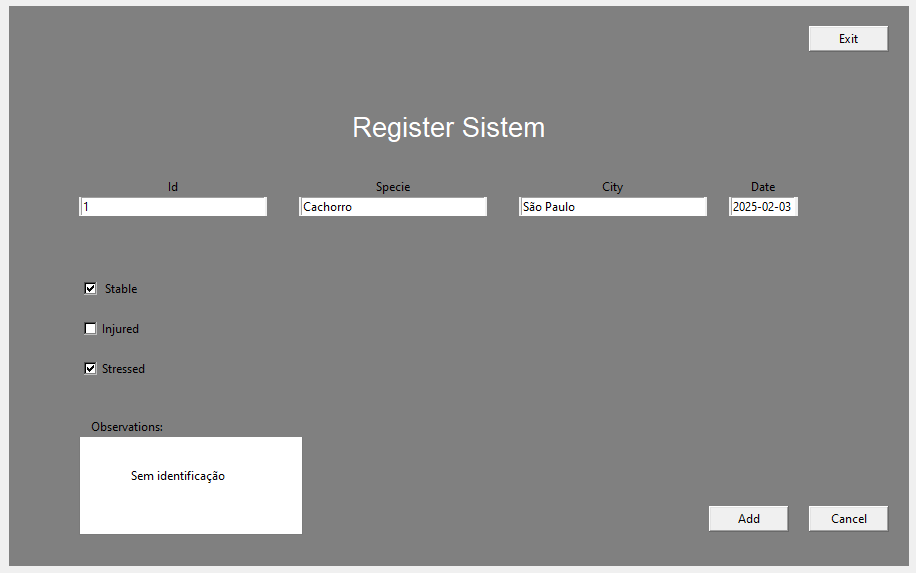
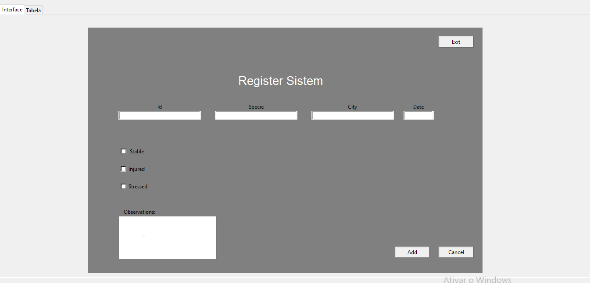
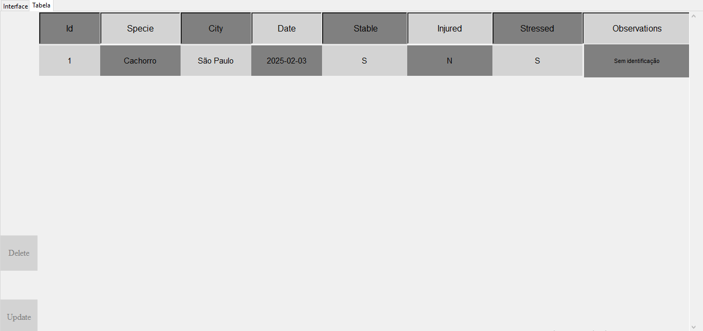

## <a>Sistema de cadastros</a> 

Com o intuito de reforçar alguns conceitos básicos como tratamento de dados, CRUDs essenciais e fundamentos de POO, este projeto tem como prosposta uma simples representação de um pequeno sistema de cadastro eletrônico de entidades.

Stack:  
* Python (GUI tikinter)
* (SGBD relacional) MySQL
* Wampserver (host virtual)

### Projeto

>Para realizar o cadastro, basta preencher os campos com suas respectivas requisições e selecionar o botão "Add":

 

>logo após, uma tabela com os registros inseridos será aberta em uma segunda aba:

 

 

 Nesta aba, apenas CRUDS básicos podem ser executados.
 >Para printar novos registros inseridos na tabela, basta clicar em "Update". Para deletar todos os registros, "Delete".

 Conforme a inserção de novos registros, eles serão sequencialmente impressos um acima do outro.

**Obs:** A configuração do database se encontra em um arquivo **.sql** separado. 
